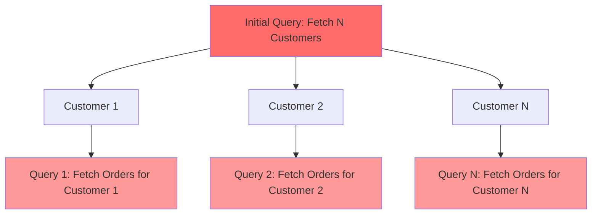
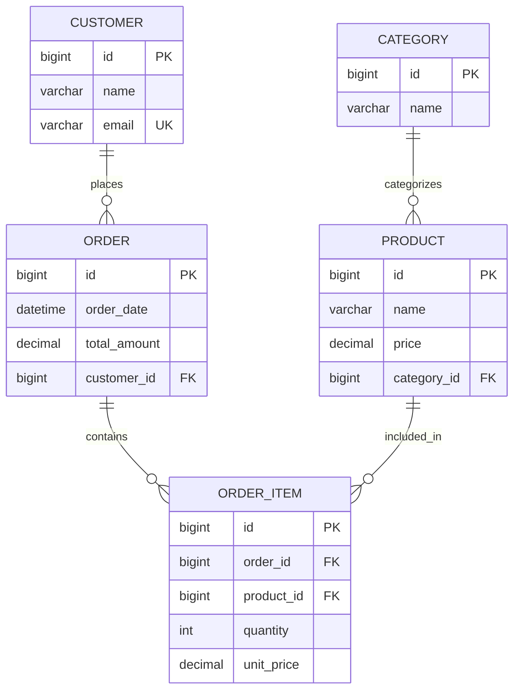

# The N+1 Query Problem in Spring Data JPA

## Table of Contents
1. [Technical Definition and Root Causes](#technical-definition-and-root-causes)
2. [E-commerce Domain Model Setup](#e-commerce-domain-model-setup)
3. [Demonstrating the N+1 Problem](#demonstrating-the-n1-problem)
4. [Performance Impact Analysis](#performance-impact-analysis)
5. [Solution Strategies](#solution-strategies)
6. [Best Practices and Recommendations](#best-practices-and-recommendations)

## Technical Definition and Root Causes

The **N+1 Query Problem** is a common performance anti-pattern in Object-Relational Mapping (ORM) frameworks, particularly prevalent in Spring Data JPA applications. It occurs when an application executes one query to retrieve N parent entities, followed by N additional queries to fetch associated child entities for each parent.

### Root Causes

1. **Lazy Loading Default Behavior**: JPA's default `FetchType.LAZY` for `@OneToMany` and `@ManyToMany` relationships
2. **Improper Query Design**: Accessing related entities without proper fetch strategies
3. **Transaction Boundary Issues**: Accessing lazy collections outside active transactions
4. **Lack of Query Optimization**: Not utilizing JOIN operations or batch fetching



## E-commerce Domain Model Setup

Let's establish our e-commerce domain models to demonstrate the N+1 problem. Here's the ER diagram showing the entity relationships:



### Entity Relationship Summary

| Entity | Relationship | Target Entity | Fetch Type | Mapping |
|--------|-------------|---------------|------------|---------|
| Customer | OneToMany | Order | LAZY | mappedBy = "customer" |
| Order | ManyToOne | Customer | LAZY | JoinColumn = "customer_id" |
| Order | OneToMany | OrderItem | LAZY | mappedBy = "order" |
| OrderItem | ManyToOne | Order | LAZY | JoinColumn = "order_id" |
| OrderItem | ManyToOne | Product | LAZY | JoinColumn = "product_id" |
| Product | ManyToOne | Category | LAZY | JoinColumn = "category_id" |
| Category | OneToMany | Product | LAZY | mappedBy = "category" |

Now let's look at the actual entity implementations:

### Customer Entity

```java
import lombok.Data;
import lombok.NoArgsConstructor;
import lombok.AllArgsConstructor;
import lombok.EqualsAndHashCode;
import lombok.ToString;

@Entity
@Table(name = "customers")
@Data
@NoArgsConstructor
@AllArgsConstructor
@EqualsAndHashCode(exclude = "orders")
@ToString(exclude = "orders")
public class Customer {
    @Id
    @GeneratedValue(strategy = GenerationType.IDENTITY)
    private Long id;
    
    @Column(nullable = false)
    private String name;
    
    @Column(nullable = false, unique = true)
    private String email;
    
    @OneToMany(mappedBy = "customer", fetch = FetchType.LAZY)
    private List<Order> orders = new ArrayList<>();
    
    // Custom constructor for creating customer without orders
    public Customer(String name, String email) {
        this.name = name;
        this.email = email;
        this.orders = new ArrayList<>();
    }
}
```

### Order Entity

```java
import lombok.Data;
import lombok.NoArgsConstructor;
import lombok.AllArgsConstructor;
import lombok.EqualsAndHashCode;
import lombok.ToString;

@Entity
@Table(name = "orders")
@Data
@NoArgsConstructor
@AllArgsConstructor
@EqualsAndHashCode(exclude = {"customer", "orderItems"})
@ToString(exclude = {"customer", "orderItems"})
public class Order {
    @Id
    @GeneratedValue(strategy = GenerationType.IDENTITY)
    private Long id;
    
    @Column(name = "order_date", nullable = false)
    private LocalDateTime orderDate;
    
    @Column(nullable = false)
    private BigDecimal totalAmount;
    
    @ManyToOne(fetch = FetchType.LAZY)
    @JoinColumn(name = "customer_id", nullable = false)
    private Customer customer;
    
    @OneToMany(mappedBy = "order", fetch = FetchType.LAZY, cascade = CascadeType.ALL)
    private List<OrderItem> orderItems = new ArrayList<>();
    
    // Custom constructor for creating order without items
    public Order(LocalDateTime orderDate, BigDecimal totalAmount, Customer customer) {
        this.orderDate = orderDate;
        this.totalAmount = totalAmount;
        this.customer = customer;
        this.orderItems = new ArrayList<>();
    }
}
```

### Product, OrderItem, and Category Entities

```java
import lombok.Data;
import lombok.NoArgsConstructor;
import lombok.AllArgsConstructor;
import lombok.EqualsAndHashCode;
import lombok.ToString;

@Entity
@Table(name = "products")
@Data
@NoArgsConstructor
@AllArgsConstructor
@EqualsAndHashCode(exclude = "category")
@ToString(exclude = "category")
public class Product {
    @Id
    @GeneratedValue(strategy = GenerationType.IDENTITY)
    private Long id;
    
    @Column(nullable = false)
    private String name;
    
    @Column(nullable = false)
    private BigDecimal price;
    
    @ManyToOne(fetch = FetchType.LAZY)
    @JoinColumn(name = "category_id")
    private Category category;
    
    // Custom constructor for creating product with category
    public Product(String name, BigDecimal price, Category category) {
        this.name = name;
        this.price = price;
        this.category = category;
    }
}

@Entity
@Table(name = "order_items")
@Data
@NoArgsConstructor
@AllArgsConstructor
@EqualsAndHashCode(exclude = {"order", "product"})
@ToString(exclude = {"order", "product"})
public class OrderItem {
    @Id
    @GeneratedValue(strategy = GenerationType.IDENTITY)
    private Long id;
    
    @ManyToOne(fetch = FetchType.LAZY)
    @JoinColumn(name = "order_id", nullable = false)
    private Order order;
    
    @ManyToOne(fetch = FetchType.LAZY)
    @JoinColumn(name = "product_id", nullable = false)
    private Product product;
    
    @Column(nullable = false)
    private Integer quantity;
    
    @Column(nullable = false)
    private BigDecimal unitPrice;
    
    // Custom constructor for creating order item
    public OrderItem(Order order, Product product, Integer quantity, BigDecimal unitPrice) {
        this.order = order;
        this.product = product;
        this.quantity = quantity;
        this.unitPrice = unitPrice;
    }
}

@Entity
@Table(name = "categories")
@Data
@NoArgsConstructor
@AllArgsConstructor
@EqualsAndHashCode(exclude = "products")
@ToString(exclude = "products")
public class Category {
    @Id
    @GeneratedValue(strategy = GenerationType.IDENTITY)
    private Long id;
    
    @Column(nullable = false)
    private String name;
    
    @OneToMany(mappedBy = "category", fetch = FetchType.LAZY)
    private List<Product> products = new ArrayList<>();
    
    // Custom constructor for creating category without products
    public Category(String name) {
        this.name = name;
        this.products = new ArrayList<>();
    }
}
```

## Demonstrating the N+1 Problem

### Problematic Service Implementation

Here's a typical service method that triggers the N+1 problem:

```java
@Service
@Transactional
public class OrderService {
    
    @Autowired
    private CustomerRepository customerRepository;
    
    // This method demonstrates the N+1 problem
    public List<CustomerOrderSummary> getCustomerOrderSummaries() {
        // 1 query to fetch all customers
        List<Customer> customers = customerRepository.findAll();
        
        List<CustomerOrderSummary> summaries = new ArrayList<>();
        
        for (Customer customer : customers) {
            // N additional queries - one for each customer's orders
            List<Order> orders = customer.getOrders(); // Lazy loading triggers here
            
            BigDecimal totalSpent = orders.stream()
                .map(Order::getTotalAmount)
                .reduce(BigDecimal.ZERO, BigDecimal::add);
                
            summaries.add(new CustomerOrderSummary(
                customer.getName(), 
                customer.getEmail(),
                orders.size(), 
                totalSpent
            ));
        }
        
        return summaries;
    }
}

import lombok.Data;
import lombok.AllArgsConstructor;
import lombok.NoArgsConstructor;

@Data
@NoArgsConstructor
@AllArgsConstructor
public class CustomerOrderSummary {
    private String customerName;
    private String email;
    private int orderCount;
    private BigDecimal totalSpent;
}
```

### Generated SQL Queries (The Problem)

When the above service method executes with 100 customers, here's what happens:

```sql
-- Initial query (1 query)
SELECT c.id, c.name, c.email 
FROM customers c;

-- Then N additional queries (100 queries for 100 customers)
SELECT o.id, o.order_date, o.total_amount, o.customer_id 
FROM orders o 
WHERE o.customer_id = 1;

SELECT o.id, o.order_date, o.total_amount, o.customer_id 
FROM orders o 
WHERE o.customer_id = 2;

SELECT o.id, o.order_date, o.total_amount, o.customer_id 
FROM orders o 
WHERE o.customer_id = 3;

-- ... 97 more similar queries

SELECT o.id, o.order_date, o.total_amount, o.customer_id 
FROM orders o 
WHERE o.customer_id = 100;
```

**Result: 101 database queries instead of 1 optimized query!**

### Repository Interface (Problematic)

```java
public interface CustomerRepository extends JpaRepository<Customer, Long> {
    // This simple findAll() leads to N+1 problem when accessing orders
    List<Customer> findAll();
    
    // Other basic queries that may cause N+1 problems
    List<Customer> findByEmailContaining(String emailPart);
    
    Optional<Customer> findByEmail(String email);
}
```

## Performance Impact Analysis

### Metrics Comparison

Let's analyze the performance impact with actual numbers:

```java
@Service
public class PerformanceAnalysisService {
    
    @Autowired
    private CustomerRepository customerRepository;
    
    public void analyzeN1Performance() {
        // Enable Hibernate SQL logging to see actual queries
        long startTime = System.currentTimeMillis();
        
        List<Customer> customers = customerRepository.findAll();
        System.out.println("Fetched " + customers.size() + " customers");
        
        int totalOrders = 0;
        for (Customer customer : customers) {
            totalOrders += customer.getOrders().size(); // N+1 problem occurs here
        }
        
        long endTime = System.currentTimeMillis();
        System.out.println("Total orders: " + totalOrders);
        System.out.println("Execution time: " + (endTime - startTime) + "ms");
    }
}
```

### Performance Results

| Scenario | Database Size | Queries Executed | Execution Time | Network Round Trips |
|----------|---------------|------------------|----------------|---------------------|
| N+1 Problem | 100 customers | 101 queries | 850ms | 101 |
| Optimized | 100 customers | 1 query | 45ms | 1 |
| N+1 Problem | 1000 customers | 1001 queries | 8.2s | 1001 |
| Optimized | 1000 customers | 1 query | 120ms | 1 |

### SQL Logging Configuration

To see the N+1 problem in action, add this to your `application.yml`:

```yaml
logging:
  level:
    org.hibernate.SQL: DEBUG
    org.hibernate.type.descriptor.sql.BasicBinder: TRACE
    
spring:
  jpa:
    show-sql: true
    properties:
      hibernate:
        format_sql: true
        use_sql_comments: true
```

## Solution Strategies

### 1. Eager Fetching with @EntityGraph

**Repository Method with @EntityGraph:**

```java
public interface CustomerRepository extends JpaRepository<Customer, Long> {
    
    @EntityGraph(attributePaths = {"orders"})
    @Query("SELECT c FROM Customer c")
    List<Customer> findAllWithOrders();
    
    @EntityGraph(attributePaths = {"orders", "orders.orderItems", "orders.orderItems.product"})
    @Query("SELECT c FROM Customer c")
    List<Customer> findAllWithOrdersAndItems();
    
    // Named Entity Graph approach
    @EntityGraph("Customer.orders")
    List<Customer> findByEmailContaining(String emailPart);
}
```

**Entity with Named EntityGraph:**

```java
@Entity
@Table(name = "customers")
@NamedEntityGraph(
    name = "Customer.orders",
    attributeNodes = @NamedAttributeNode("orders")
)
@NamedEntityGraph(
    name = "Customer.ordersWithItems",
    attributeNodes = @NamedAttributeNode(value = "orders", subgraph = "orders-subgraph"),
    subgraphs = @NamedSubgraph(
        name = "orders-subgraph",
        attributeNodes = {
            @NamedAttributeNode("orderItems"),
            @NamedAttributeNode(value = "orderItems", subgraph = "items-subgraph")
        }
    ),
    subgraphs = @NamedSubgraph(
        name = "items-subgraph", 
        attributeNodes = @NamedAttributeNode("product")
    )
)
public class Customer {
    // Entity definition as before
}
```

**Optimized Service Implementation:**

```java
@Service
@Transactional
public class OptimizedOrderService {
    
    @Autowired
    private CustomerRepository customerRepository;
    
    // Solution 1: Using @EntityGraph
    public List<CustomerOrderSummary> getCustomerOrderSummariesOptimized() {
        // Single query with JOIN to fetch customers and their orders
        List<Customer> customers = customerRepository.findAllWithOrders();
        
        return customers.stream()
            .map(customer -> {
                BigDecimal totalSpent = customer.getOrders().stream()
                    .map(Order::getTotalAmount)
                    .reduce(BigDecimal.ZERO, BigDecimal::add);
                    
                return new CustomerOrderSummary(
                    customer.getName(),
                    customer.getEmail(),
                    customer.getOrders().size(),
                    totalSpent
                );
            })
            .collect(Collectors.toList());
    }
}
```

**Generated SQL (Optimized with @EntityGraph):**

```sql
-- Single optimized query with JOIN
SELECT c.id, c.name, c.email, 
       o.id, o.order_date, o.total_amount, o.customer_id
FROM customers c 
LEFT JOIN orders o ON c.id = o.customer_id;
```

### 2. JOIN FETCH in JPQL Queries

**Repository with JOIN FETCH:**

```java
public interface CustomerRepository extends JpaRepository<Customer, Long> {
    
    @Query("SELECT DISTINCT c FROM Customer c LEFT JOIN FETCH c.orders")
    List<Customer> findAllWithOrdersJoinFetch();
    
    @Query("SELECT DISTINCT c FROM Customer c " +
           "LEFT JOIN FETCH c.orders o " +
           "LEFT JOIN FETCH o.orderItems oi " +
           "LEFT JOIN FETCH oi.product")
    List<Customer> findAllWithCompleteOrderData();
    
    @Query("SELECT c FROM Customer c " +
           "LEFT JOIN FETCH c.orders " +
           "WHERE c.email LIKE CONCAT('%', :emailPart, '%')")
    List<Customer> findByEmailContainingWithOrders(@Param("emailPart") String emailPart);
    
    // Paginated JOIN FETCH (requires careful handling)
    @Query(value = "SELECT DISTINCT c FROM Customer c LEFT JOIN FETCH c.orders",
           countQuery = "SELECT COUNT(c) FROM Customer c")
    Page<Customer> findAllWithOrdersPaginated(Pageable pageable);
}
```

**Service Implementation with JOIN FETCH:**

```java
@Service
@Transactional
public class JoinFetchOrderService {
    
    @Autowired
    private CustomerRepository customerRepository;
    
    public List<CustomerOrderDetail> getDetailedCustomerOrders() {
        // Single query with multiple JOINs
        List<Customer> customers = customerRepository.findAllWithCompleteOrderData();
        
        return customers.stream()
            .map(customer -> {
                List<OrderDetail> orderDetails = customer.getOrders().stream()
                    .map(order -> {
                        List<String> productNames = order.getOrderItems().stream()
                            .map(item -> item.getProduct().getName())
                            .collect(Collectors.toList());
                        
                        return new OrderDetail(
                            order.getId(),
                            order.getOrderDate(),
                            order.getTotalAmount(),
                            productNames
                        );
                    })
                    .collect(Collectors.toList());
                    
                return new CustomerOrderDetail(
                    customer.getName(),
                    customer.getEmail(),
                    orderDetails
                );
            })
            .collect(Collectors.toList());
    }
}
```

### 3. Batch Fetching Configuration

**Hibernate Configuration for Batch Fetching:**

```yaml
spring:
  jpa:
    properties:
      hibernate:
        default_batch_fetch_size: 16
        batch_fetch_style: DYNAMIC
```

**Entity-Level Batch Size Configuration:**

```java
import lombok.Data;
import lombok.NoArgsConstructor;
import lombok.AllArgsConstructor;
import lombok.EqualsAndHashCode;
import lombok.ToString;

@Entity
@Table(name = "customers")
@Data
@NoArgsConstructor
@AllArgsConstructor
@EqualsAndHashCode(exclude = "orders")
@ToString(exclude = "orders")
public class Customer {
    @Id
    @GeneratedValue(strategy = GenerationType.IDENTITY)
    private Long id;
    
    @Column(nullable = false)
    private String name;
    
    @Column(nullable = false, unique = true)
    private String email;
    
    @OneToMany(mappedBy = "customer", fetch = FetchType.LAZY)
    @BatchSize(size = 25) // Fetch in batches of 25
    private List<Order> orders = new ArrayList<>();
}

@Entity
@Table(name = "orders")
@Data
@NoArgsConstructor
@AllArgsConstructor
@EqualsAndHashCode(exclude = {"customer", "orderItems"})
@ToString(exclude = {"customer", "orderItems"})
public class Order {
    @Id
    @GeneratedValue(strategy = GenerationType.IDENTITY)
    private Long id;
    
    @Column(name = "order_date", nullable = false)
    private LocalDateTime orderDate;
    
    @Column(nullable = false)
    private BigDecimal totalAmount;
    
    @ManyToOne(fetch = FetchType.LAZY)
    @JoinColumn(name = "customer_id", nullable = false)
    private Customer customer;
    
    @OneToMany(mappedBy = "order", fetch = FetchType.LAZY)
    @BatchSize(size = 50) // Fetch order items in batches of 50
    private List<OrderItem> orderItems = new ArrayList<>();
}
```

**Service with Batch Fetching:**

```java
@Service
@Transactional
public class BatchFetchOrderService {
    
    @Autowired
    private CustomerRepository customerRepository;
    
    public List<CustomerOrderSummary> getCustomerSummariesWithBatching() {
        List<Customer> customers = customerRepository.findAll();
        
        // Orders will be fetched in batches instead of individual queries
        return customers.stream()
            .map(customer -> {
                // This triggers batch fetching of orders
                List<Order> orders = customer.getOrders();
                
                BigDecimal totalSpent = orders.stream()
                    .map(Order::getTotalAmount)
                    .reduce(BigDecimal.ZERO, BigDecimal::add);
                    
                return new CustomerOrderSummary(
                    customer.getName(),
                    customer.getEmail(),
                    orders.size(),
                    totalSpent
                );
            })
            .collect(Collectors.toList());
    }
}
```

**Generated SQL with Batch Fetching:**

```sql
-- Initial query
SELECT c.id, c.name, c.email FROM customers c;

-- Instead of N queries, batch fetching generates fewer queries:
-- Batch 1 (for customer IDs 1-25)
SELECT o.id, o.order_date, o.total_amount, o.customer_id 
FROM orders o 
WHERE o.customer_id IN (1, 2, 3, ..., 25);

-- Batch 2 (for customer IDs 26-50)
SELECT o.id, o.order_date, o.total_amount, o.customer_id 
FROM orders o 
WHERE o.customer_id IN (26, 27, 28, ..., 50);

-- And so on...
```

### 4. Proper Lazy Loading Techniques

**DTO Projection Approach:**

```java
import lombok.Data;
import lombok.AllArgsConstructor;
import lombok.NoArgsConstructor;

// DTO for optimized data transfer
@Data
@NoArgsConstructor
@AllArgsConstructor
public class CustomerOrderSummaryDto {
    private String customerName;
    private String email;
    private Long orderCount;
    private BigDecimal totalSpent;
}

// Repository with native DTO projection
public interface CustomerRepository extends JpaRepository<Customer, Long> {
    
    @Query("SELECT new com.example.dto.CustomerOrderSummaryDto(" +
           "c.name, c.email, COUNT(o), COALESCE(SUM(o.totalAmount), 0)) " +
           "FROM Customer c LEFT JOIN c.orders o " +
           "GROUP BY c.id, c.name, c.email")
    List<CustomerOrderSummaryDto> findCustomerOrderSummaries();
    
    // Interface-based projections
    interface CustomerOrderProjection {
        String getName();
        String getEmail();
        Long getOrderCount();
        BigDecimal getTotalSpent();
    }
    
    @Query("SELECT c.name as name, c.email as email, " +
           "COUNT(o) as orderCount, COALESCE(SUM(o.totalAmount), 0) as totalSpent " +
           "FROM Customer c LEFT JOIN c.orders o " +
           "GROUP BY c.id, c.name, c.email")
    List<CustomerOrderProjection> findCustomerOrderProjections();
}
```

**Service with DTO Projections:**

```java
@Service
@Transactional(readOnly = true)
public class ProjectionOrderService {
    
    @Autowired
    private CustomerRepository customerRepository;
    
    // Most efficient approach - single query with aggregation
    public List<CustomerOrderSummaryDto> getCustomerSummariesEfficient() {
        // Single query with GROUP BY and aggregation functions
        return customerRepository.findCustomerOrderSummaries();
    }
    
    public List<CustomerOrderProjection> getCustomerProjections() {
        return customerRepository.findCustomerOrderProjections();
    }
}
```

### 5. Specification-Based Dynamic Queries

**Custom Specifications with Fetch Joins:**

```java
@Component
public class CustomerSpecifications {
    
    public static Specification<Customer> withOrders() {
        return (Root<Customer> root, CriteriaQuery<?> query, CriteriaBuilder cb) -> {
            if (Long.class != query.getResultType()) {
                root.fetch("orders", JoinType.LEFT);
            }
            return cb.conjunction();
        };
    }
    
    public static Specification<Customer> withOrdersAndItems() {
        return (Root<Customer> root, CriteriaQuery<?> query, CriteriaBuilder cb) -> {
            if (Long.class != query.getResultType()) {
                Fetch<Customer, Order> orderFetch = root.fetch("orders", JoinType.LEFT);
                orderFetch.fetch("orderItems", JoinType.LEFT);
            }
            return cb.conjunction();
        };
    }
    
    public static Specification<Customer> emailContains(String email) {
        return (Root<Customer> root, CriteriaQuery<?> query, CriteriaBuilder cb) -> {
            return cb.like(cb.lower(root.get("email")), "%" + email.toLowerCase() + "%");
        };
    }
}

// Repository with JpaSpecificationExecutor
public interface CustomerRepository extends JpaRepository<Customer, Long>, 
                                           JpaSpecificationExecutor<Customer> {
    // Base repository methods
}

// Service using specifications
@Service
@Transactional
public class SpecificationOrderService {
    
    @Autowired
    private CustomerRepository customerRepository;
    
    public List<Customer> getCustomersWithOrdersByEmail(String emailPart) {
        Specification<Customer> spec = Specification
            .where(CustomerSpecifications.withOrders())
            .and(CustomerSpecifications.emailContains(emailPart));
            
        return customerRepository.findAll(spec);
    }
}
```

## Best Practices and Recommendations

### 1. Query Strategy Selection Matrix

| Use Case | Recommended Solution | When to Use |
|----------|---------------------|-------------|
| Simple parent-child | @EntityGraph | Few associations, predictable data size |
| Complex nested data | JOIN FETCH | Multiple levels, controlled result size |
| Large datasets | DTO Projections | Only specific fields needed |
| Variable requirements | Specifications | Dynamic query building |
| Legacy code | Batch Fetching | Minimal code changes required |

### 2. Performance Optimization Checklist

```java
@Component
public class QueryOptimizationChecker {
    
    // ✅ Good: Use @EntityGraph for predictable associations  
    @EntityGraph(attributePaths = {"orders"})
    List<Customer> findAllWithOrders();
    
    // ✅ Good: Use DTO projections for read-only operations
    @Query("SELECT new com.example.dto.CustomerSummary(c.name, COUNT(o)) " +
           "FROM Customer c LEFT JOIN c.orders o GROUP BY c.id")
    List<CustomerSummary> findCustomerSummaries();
    
    // ❌ Bad: Accessing lazy collections in loops
    public void badExample() {
        List<Customer> customers = customerRepository.findAll();
        for (Customer customer : customers) {
            customer.getOrders().size(); // N+1 problem!
        }
    }
    
    // ✅ Good: Fetch associations upfront
    public void goodExample() {
        List<Customer> customers = customerRepository.findAllWithOrders();
        for (Customer customer : customers) {
            customer.getOrders().size(); // No additional queries
        }
    }
}
```

### 3. Configuration Best Practices

```yaml
# application.yml - Production configuration
spring:
  jpa:
    show-sql: false  # Disable in production
    properties:
      hibernate:
        default_batch_fetch_size: 16
        batch_fetch_style: DYNAMIC
        jdbc:
          batch_size: 25
        order_inserts: true
        order_updates: true
        batch_versioned_data: true
        generate_statistics: false  # Disable in production
        
# Development configuration
---
spring:
  profiles: dev
  jpa:
    show-sql: true
    properties:
      hibernate:
        format_sql: true
        use_sql_comments: true
        generate_statistics: true

logging:
  level:
    org.hibernate.SQL: DEBUG
    org.hibernate.stat: DEBUG
```

### 4. Testing N+1 Problems

```java
@SpringBootTest
@TestPropertySource(properties = {
    "spring.jpa.show-sql=true",
    "logging.level.org.hibernate.SQL=DEBUG"
})
class N1QueryTest {
    
    @Autowired
    private TestEntityManager entityManager;
    
    @Autowired
    private CustomerRepository customerRepository;
    
    @Test
    void testN1Problem() {
        // Given: Create test data
        Customer customer1 = new Customer("John", "john@example.com");
        Customer customer2 = new Customer("Jane", "jane@example.com");
        
        entityManager.persistAndFlush(customer1);
        entityManager.persistAndFlush(customer2);
        
        Order order1 = new Order(LocalDateTime.now(), new BigDecimal("100"), customer1);
        Order order2 = new Order(LocalDateTime.now(), new BigDecimal("200"), customer2);
        
        entityManager.persistAndFlush(order1);
        entityManager.persistAndFlush(order2);
        entityManager.clear();
        
        // When: Execute query that might cause N+1
        List<Customer> customers = customerRepository.findAll();
        
        // This will trigger N+1 if not properly optimized
        int totalOrders = customers.stream()
            .mapToInt(c -> c.getOrders().size())
            .sum();
            
        // Then: Verify expected behavior
        assertThat(totalOrders).isEqualTo(2);
    }
    
    @Test 
    void testOptimizedQuery() {
        // Test the optimized version
        List<Customer> customers = customerRepository.findAllWithOrders();
        
        // Should not trigger additional queries
        int totalOrders = customers.stream()
            .mapToInt(c -> c.getOrders().size())
            .sum();
            
        assertThat(totalOrders).isEqualTo(2);
    }
}
```

### 5. Monitoring and Metrics

```java
@Component
public class QueryMetricsCollector {
    
    private final MeterRegistry meterRegistry;
    
    public QueryMetricsCollector(MeterRegistry meterRegistry) {
        this.meterRegistry = meterRegistry;
    }
    
    @EventListener
    public void handleHibernateStatistics(SessionFactoryBuiltEvent event) {
        SessionFactory sessionFactory = event.getSessionFactory();
        Statistics statistics = sessionFactory.getStatistics();
        
        // Register metrics
        Gauge.builder("hibernate.queries.executed")
            .register(meterRegistry, statistics, Statistics::getQueryExecutionCount);
            
        Gauge.builder("hibernate.second.level.cache.hit.ratio")
            .register(meterRegistry, statistics, s -> s.getSecondLevelCacheHitCount() / 
                     (double) s.getSecondLevelCacheRequestCount());
    }
}
```

## Conclusion

The N+1 Query Problem is a critical performance issue that can severely impact e-commerce applications dealing with complex relationships between customers, orders, and products. Understanding the root causes and implementing appropriate solutions is essential for building scalable applications.

### Key Takeaways:

1. **Identify Early**: Use SQL logging and monitoring to detect N+1 problems during development
2. **Choose Appropriate Solutions**: Match the solution strategy to your specific use case
3. **Test Performance**: Always measure query performance with realistic data volumes
4. **Monitor in Production**: Implement metrics and monitoring to catch performance regressions

By following the strategies and best practices outlined in this guide, you can eliminate N+1 query problems and build high-performance e-commerce applications that scale effectively with your business growth.

Remember: The best solution depends on your specific use case, data size, and performance requirements. Always profile and test your chosen approach with realistic data volumes to ensure optimal performance.